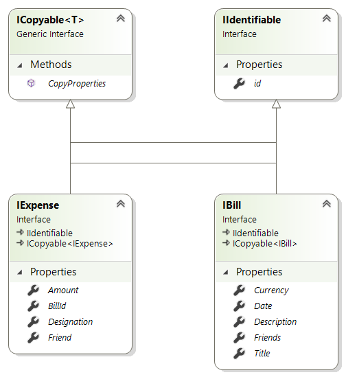
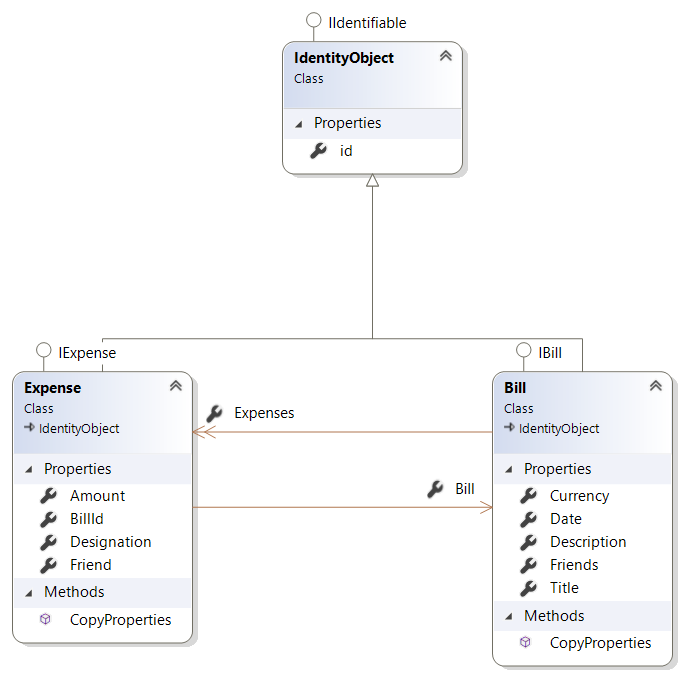

# Igual Fabricante (Domainname: IgualFabricante)
Beschreibung vom Projekt.  
Das ist eine neue Zeile.  
Eine Auflistung kann wie folgt erstellt werden:  
+ **Schritt1:**
+ **Schritt2:**
+ *Schritt3:*

Ein Programmabschnitt kann auch eingefügt werden. Dazu verwendet man folgende Syntax:
```csharp
public class Person 
{
	public string FirstName { get; set; }
}
```

## Projektstruktur erstellen
+ **Schritt 1**  
Projektname überlegen und mit diesem Namen eine 'Solution' erstellen
+ **Schritt 2**  
Eine Klassenbibliothek 'CommonBase' erstellen. In dieser Bibliothek werden alle Algorithmen, welche unabhängig vom Domain-Bereich sind, gesammelt.  
+ **Schritt 3**  
Eine Klassenbibliothek für die Schnittstellen anlegen. Der Projektname wird wie folgt definiert: [Domainname].Contracts. 
+ **Schritt 4**  
Eine Klassenbinliothek für die Geschäftslogik. In diesem Projekt werden alle Geschäftsprozesse gesammelt. Der Projektname wird wie folgt definiert: [Domainname].Logic.
+ **Schritt 5**  
Erstellen einer Konsolenanwendung zum Testen der Struktur. Der Projektname wird wie folgt definiert: [Domainname].ConApp  
*Im weiteren Ausbau werden noch weitere Projekte hinzugefügt (z.b. Rest-Service)*  
+ **Schritt 6**  
Abhängigkeiten definieren.

## Projekt: Schnittstellen  

### Schnittstellen definieren  



## Projekt: Logik  

### Entitäten definieren  



### Weitere Aktionen  

Folgende NuGet-Packages hinzufügen:

+ Microsoft.EntityFrameworkCore  
+ Microsoft.EntityFrameworkCore.SqlServer
+ Microsoft.EntityFrameworkCore.Tools

Wenn die Migration verwendet wird, dann muss zur Konsolen-Anwendung das folgende NuGet-Packet hinzugefügt werden:
+ Microsoft.EntityFrameworkCore.Design